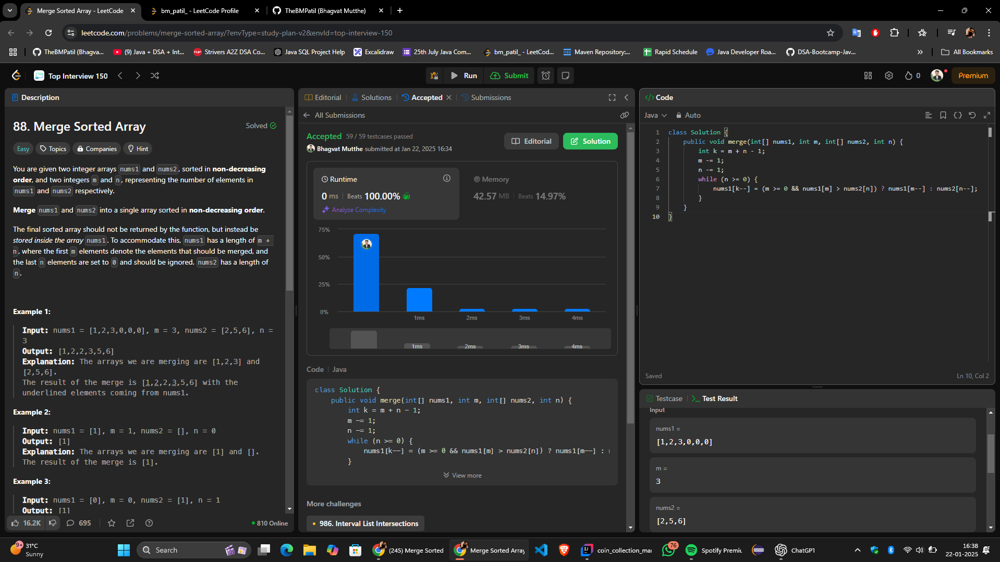

# **"🔥 The Most Optimal In-Place Solution to Merge Sorted Arrays — No Extra Space Required! 🚀"**  
# Intuition
When merging two sorted arrays, we want to maintain the sorted order efficiently. The key is to avoid using extra space by leveraging the fact that the first array (`nums1`) already has enough space to accommodate all elements.

By merging the arrays from the back, we can place the largest elements in their correct positions without overwriting smaller elements.

# Approach
We use a two-pointer approach, starting from the last valid elements of both arrays (`nums1` and `nums2`). A third pointer tracks the position in `nums1` where the next element should go. 

1. Start pointers `m` and `n` at the last elements of `nums1` and `nums2`, respectively.
2. Compare the elements pointed to by `m` and `n`.
3. Place the larger of the two at the current position (`k`) in `nums1` and move the corresponding pointer.
4. Repeat until all elements of `nums2` are placed in `nums1`.

This avoids the need for additional space and works efficiently in \(O(m + n)\) time.

# Complexity
- **Time complexity:**  
  \(O(m + n)\), as we traverse both arrays once.

- **Space complexity:**  
  \(O(1)\), since we modify `nums1` in-place without using extra memory.

# Code
```java
class Solution {
    public void merge(int[] nums1, int m, int[] nums2, int n) {
        int k = m + n - 1;
        m -= 1;
        n -= 1;
        while (n >= 0) {
            nums1[k--] = (m >= 0 && nums1[m] > nums2[n]) ? nums1[m--] : nums2[n--];
        }
    }
}
```
# Submission


# Conclusion
This approach efficiently merges two sorted arrays in-place, preserving the sorted order and ensuring minimal memory usage. It highlights how we can leverage array indices and avoid unnecessary allocations for optimal performance.

Let me know your thoughts or suggestions for further improvement! 🚀
