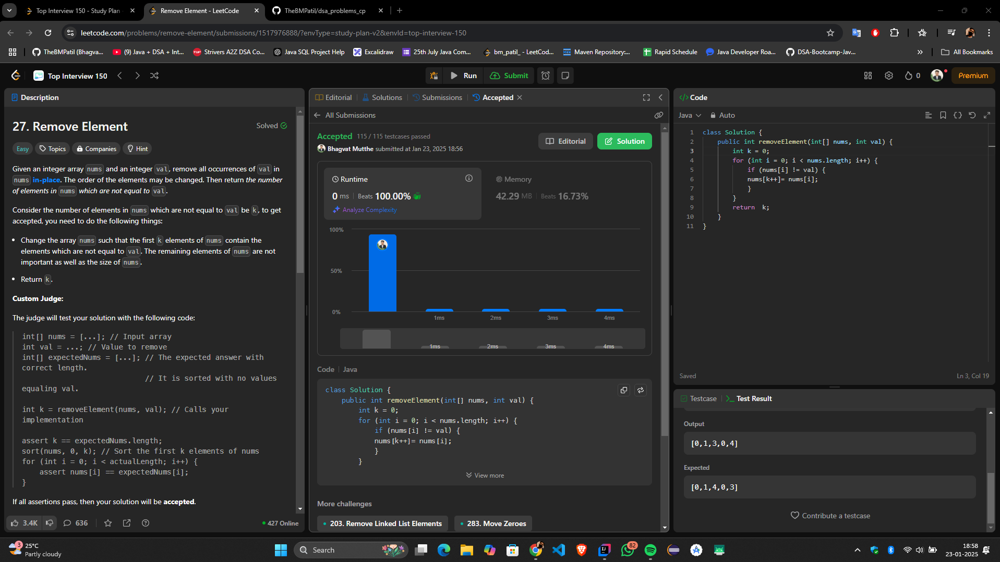

# **"🔥 Efficient In-Place Solution to Remove Element — Minimal Space, Maximum Performance! 🚀"**

## **Intuition**
The task is to remove all occurrences of a given value (`val`) from the array `nums` in-place. The goal is to shift all elements not equal to `val` to the beginning of the array and return the new length `k`, representing the number of elements remaining.

The key idea is to use a **two-pointer approach** where one pointer (`k`) keeps track of the position to overwrite values in `nums`, and the other pointer iterates through the array.

This approach avoids creating a new array, which reduces space usage and works efficiently by processing elements in a single pass.

---

## **Approach**
1. **Pointer `k`:** Keeps track of the index in `nums` where the next valid element (not equal to `val`) should be placed.
2. **Iterate through the array:** For each element in `nums`:
  - If the element is **not equal** to `val`, overwrite `nums[k]` with the current element and increment `k`.
  - If the element equals `val`, skip it.
3. After the loop completes, the first `k` elements of `nums` will contain all valid elements in any order.

By the end, `k` represents the length of the modified array with all occurrences of `val` removed.

---

## **Complexity**
- **Time Complexity:**  
  \(O(n)\), where \(n\) is the length of the array. We traverse the array once.

- **Space Complexity:**  
  \(O(1)\), as no additional space is used.

---

## **Code**
```java
class Solution {
    public int removeElement(int[] nums, int val) {
        int k = 0; // Pointer to track valid elements
        for (int i = 0; i < nums.length; i++) {
            if (nums[i] != val) {
                nums[k++] = nums[i]; // Place valid elements at the start
            }
        }
        return k; // Length of the modified array
    }
}
```


## **Submission**


---

## **Conclusion**
This approach provides a simple and efficient solution to the "Remove Element" problem. It highlights the power of a two-pointer strategy to modify arrays in-place without additional memory overhead. This method ensures both clarity and optimal performance.

Let me know your thoughts or improvements on this! 🚀