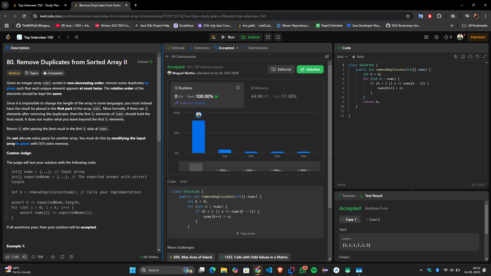

# **"🔥 Efficient Solution for Removing Duplicates (Allowing Up to Two Occurrences) — Minimal Space, Maximum Performance! 🚀"**

## **Intuition**
The task is to remove duplicates in a sorted array such that each unique element appears at most twice. The modified array should maintain the relative order of the elements, and the result must be stored in the same array in-place.

The key observation is that for an element to be valid, it should either:
1. Be among the first two elements, or
2. Differ from the element two positions before it.

This insight allows us to use a **two-pointer approach** to efficiently overwrite invalid duplicates.

---

## **Approach**
1. **Pointer `k`:** Tracks the position in `nums` where the next valid element should be placed.
2. **Iterate through the array:** For each element in `nums`:
  - If `k` is less than 2 (i.e., the first two elements) or the current element differs from the element two positions before it (`nums[k - 2]`), overwrite `nums[k]` with the current element and increment `k`.
  - Skip elements that violate the "at most twice" condition.
3. After the loop completes, the first `k` elements of `nums` will contain the modified result.

By the end, `k` represents the new length of the array, with all duplicates reduced to at most two occurrences.

---

## **Complexity**
- **Time Complexity:**  
  \(O(n)\), where \(n\) is the length of the array. Each element is processed once.

- **Space Complexity:**  
  \(O(1)\), as no additional space is allocated.

---

## **Code**
```java
class Solution {
    public int removeDuplicates(int[] nums) {
        int k = 0; // Pointer to track valid elements
        for (int n : nums) {
            if (k < 2 || n != nums[k - 2]) { // Allow up to two occurrences
                nums[k++] = n;
            }
        }
        return k; // Length of the modified array
    }
}
```

---

## **Submission**


---

## **Conclusion**
This solution effectively handles the problem of reducing duplicates to at most two occurrences while maintaining the original order. It highlights the power of a simple condition and a two-pointer strategy to achieve optimal results with minimal memory usage.

Let me know your thoughts or suggestions for improvement! 🚀