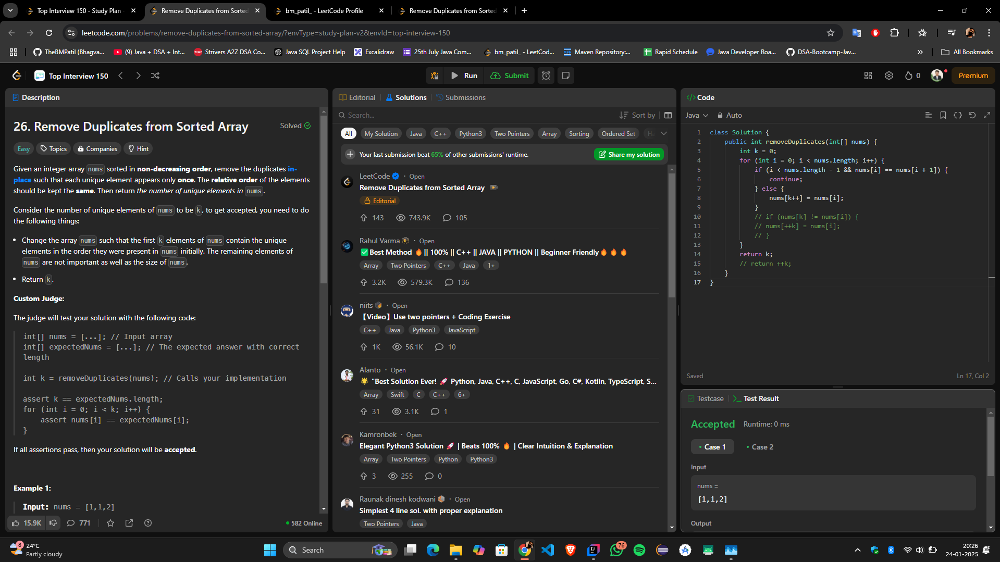

# **"🔥 Efficient Solution for Removing Duplicates from Sorted Array — Minimal Space, Maximum Performance! 🚀"**

## **Intuition**
The task is to remove duplicates from a sorted array so that each unique element appears only once. The modified array should maintain the relative order of the elements, and the result must be stored in the same array in-place.

The key observation is that duplicates in a sorted array will always appear consecutively. This allows us to use a **two-pointer approach** to efficiently process the array without additional space. The first pointer (`k`) tracks the position where the next unique element should be placed, and the second pointer iterates through the array to identify unique elements.

---

## **Approach**
1. **Pointer `k`:** Tracks the position in `nums` where the next unique element should be placed.
2. **Iterate through the array:** For each element `nums[i]`:
  - If the current element is not equal to the previous one (`nums[i] != nums[i - 1]`), it is unique. Copy this element to `nums[k]` and increment `k`.
  - Skip duplicates.
3. After the loop completes, the first `k` elements of `nums` will contain the modified result with unique elements.

By the end, `k` represents the new length of the array, with all duplicates removed.

---

## **Complexity**
- **Time Complexity:**  
  \(O(n)\), where \(n\) is the length of the array. Each element is processed once.

- **Space Complexity:**  
  \(O(1)\), as no additional space is allocated.

---

## **Code**
```java
class Solution {
    public int removeDuplicates(int[] nums) {
        int k = 0; // Pointer to track unique elements
        for (int i = 0; i < nums.length; i++) {
            if (i == 0 || nums[i] != nums[i - 1]) { // If it's the first element or different from the previous one
                nums[k++] = nums[i]; // Place the unique element in position k
            }
        }
        return k; // Length of the modified array
    }
}
```

---

## **Submission**


---

## **Conclusion**
This solution effectively removes duplicates from a sorted array in-place while maintaining the original order of elements. It demonstrates the elegance of the two-pointer technique, achieving optimal performance with minimal memory usage.

Let me know your thoughts or suggestions for improvement! 🚀