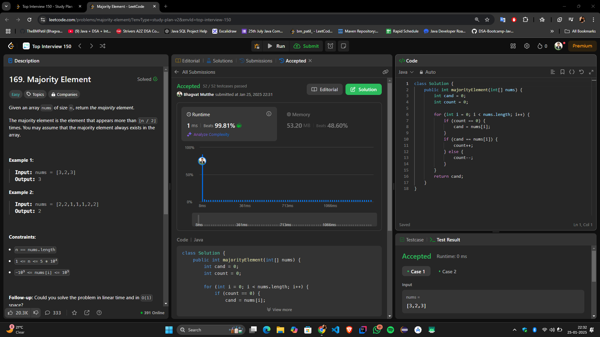

# **🔥 Efficient Solution for Finding the Majority Element — Boyer-Moore Voting Algorithm! 🚀**

---

## **Intuition**
The task is to find the majority element in an array, defined as the element that appears more than `⌊n / 2⌋` times. The key insight here is that the majority element, by definition, dominates the array. This means if we cancel out every occurrence of non-majority elements in pairs, the majority element will still remain. This forms the foundation of the **Boyer-Moore Voting Algorithm**, a linear-time, constant-space solution.

---

## **Approach**
1. **Candidate Selection:**
  - Use two variables:
    - `cand` to store the potential majority element.
    - `count` to track the "support" for the candidate.
  - Traverse the array:
    - If `count` is 0, assign the current element to `cand`.
    - If the current element matches `cand`, increment `count`. Otherwise, decrement `count`.
  - At the end of this loop, `cand` will be the majority element.

2. **Candidate Verification (Optional):**
  - If the problem does not guarantee a majority element, we can make a second pass to verify that `cand` appears more than `n / 2` times. However, in this specific problem, verification is unnecessary.

---

## **Complexity**
- **Time Complexity:**  
  \(O(n)\), where \(n\) is the size of the array. We make a single pass to identify the candidate.

- **Space Complexity:**  
  \(O(1)\), as we only use two variables (`cand` and `count`) irrespective of the input size.

---

## **Code**
```java
class Solution {
    public int majorityElement(int[] nums) {
        int cand = 0; // Stores the majority element candidate
        int count = 0; // Tracks the count of the candidate

        for (int num : nums) {
            // If count is zero, choose the current element as the new candidate
            if (count == 0) {
                cand = num;
            }
            // Adjust count based on whether the current element matches the candidate
            count += (cand == num) ? 1 : -1;
        }

        return cand; // The majority element
    }
}
```

---

## **Submission**


---

## **Conclusion**
This solution is a **perfect blend of simplicity and efficiency**, leveraging the dominance property of the majority element. It showcases how a smart observation (cancelling elements in pairs) can lead to an optimal algorithm with minimal overhead.

Have suggestions or feedback? Let me know! 🚀