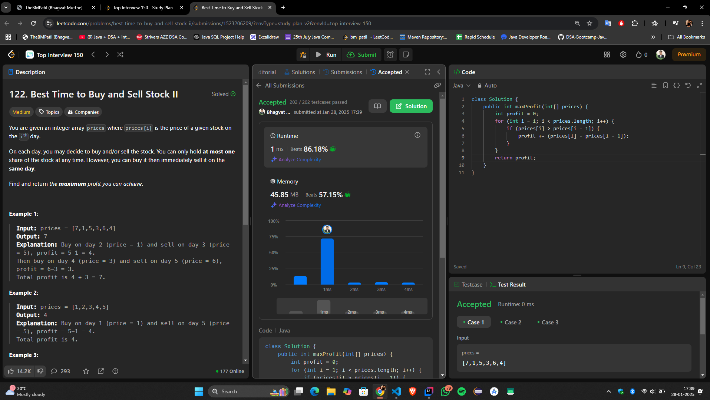

# **🔥 Maximize Stock Profit with Unlimited Transactions in \(O(n)\) — Optimal Solution 🚀**

## **Problem Statement**
You are given an array `prices` where `prices[i]` represents the price of a stock on the \(i\)-th day.  
You are allowed to complete as many transactions as you like (i.e., buy one and sell one share of the stock multiple times).

**Goal:** Maximize the total profit. You may not engage in multiple transactions simultaneously (i.e., you must sell before buying again).

---

## **Intuition**
The key insight here is that the profit can be maximized by summing up all the **positive price differences** between consecutive days.
- If the price on day \(i\) is higher than on day \(i-1\), the difference represents a profit we can earn by buying on day \(i-1\) and selling on day \(i\).
- We do not need to explicitly keep track of buy/sell days, as the sum of these differences represents the overall profit.

By iterating through the array and adding all the upward trends, we ensure that we capture every opportunity for profit.

---

## **Approach**
1. **Initialize Variables:**
    - `profit` to 0 to keep track of the total profit.
2. **Iterate Through the Array:**
    - Compare the price on day \(i\) with day \(i-1\).
    - If \(prices[i] > prices[i-1]\), calculate the profit as \(prices[i] - prices[i-1]\) and add it to `profit`.
3. **Return the Result:**
    - The total `profit` at the end of the loop represents the maximum achievable profit.

---

## **Complexity**
- **Time Complexity:**  
  \(O(n)\), as we traverse the array once.

- **Space Complexity:**  
  \(O(1)\), since we use a constant amount of space.

---

## **Code**
```java
class Solution {
    public int maxProfit(int[] prices) {
        if (prices == null || prices.length < 2) {
            return 0; // No profit possible
        }

        int profit = 0;

        for (int i = 1; i < prices.length; i++) {
            // Add the profit for every upward trend
            if (prices[i] > prices[i - 1]) {
                profit += prices[i] - prices[i - 1];
            }
        }

        return profit;
    }
}
```
---
## **Submission**


---


## **Key Example**
Input: `prices = [7, 1, 5, 3, 6, 4]`

1. **Day 2:** No profit (\(1 < 7\))
2. **Day 3:** Profit = \(5 - 1 = 4\), Total Profit = \(4\)
3. **Day 4:** No profit (\(3 < 5\))
4. **Day 5:** Profit = \(6 - 3 = 3\), Total Profit = \(7\)
5. **Day 6:** No profit (\(4 < 6\))

Output: `7`

---

## **Edge Cases**
1. **Empty or Single Element Array:**  
   Input: `prices = []` or `prices = [5]`  
   Output: `0` (No profit possible)
2. **Descending Prices:**  
   Input: `prices = [7, 6, 4, 3, 1]`  
   Output: `0` (No profitable transaction possible)
3. **Constant Prices:**  
   Input: `prices = [3, 3, 3, 3]`  
   Output: `0` (No profit possible)

---

## **Conclusion**
This solution leverages the simplicity of identifying all price increases to maximize profit in a single pass. It is efficient, intuitive, and ensures that no profitable opportunity is missed. 🚀

---