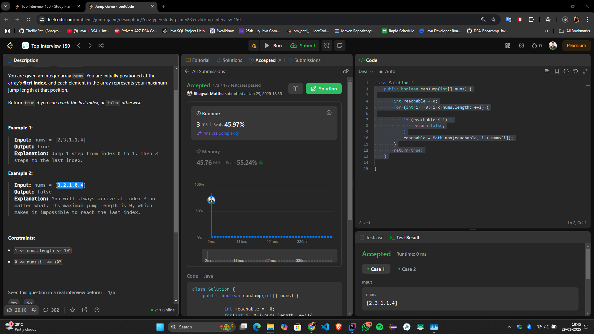

# **🔥 Can You Jump to the Last Index in \(O(n)\)? — Optimal Solution 🚀**

## **Problem Statement**
You are given an array `nums` where `nums[i]` represents the maximum jump length from the \(i\)-th index.

**Goal:** Determine if you can reach the last index starting from the first index.

---

## **Intuition**
This problem can be tackled using a **greedy approach** by keeping track of the farthest index (`reachable`) we can reach as we iterate through the array:
- At each index \(i\), check if \(i\) is reachable. If not, return `false` because we can't move forward from there.
- Update the farthest reachable position to \( \max(\text{reachable}, i + \text{nums}[i]) \).  
  If we reach the last index or go beyond it, return `true`.

This way, we ensure that we only calculate what is necessary to determine reachability without backtracking.

---

## **Approach**
1. **Initialize Variables:**
   - Start with `reachable = 0` to track the farthest index we can reach.
2. **Iterate Through the Array:**
   - For each index \(i\), check if \(i > \text{reachable}\). If true, return `false` because you are stuck.
   - Otherwise, update `reachable` to \( \max(\text{reachable}, i + \text{nums}[i]) \).
3. **Return the Result:**
   - If the loop completes without returning `false`, it means the last index is reachable.

---

## **Complexity**
- **Time Complexity:**  
  \(O(n)\), where \(n\) is the length of the array. We traverse the array once.

- **Space Complexity:**  
  \(O(1)\), as only a few variables are used for tracking.

---

## **Code**
```java
class Solution {
    public boolean canJump(int[] nums) {
        int reachable = 0;
        for (int i = 0; i < nums.length; i++) {
            if (reachable < i) {
                return false; // Stuck, index is unreachable
            }
            reachable = Math.max(reachable, i + nums[i]);
        }
        return true; // Successfully reached or surpassed the last index
    }
}
```

---

## **Submission**


---

## **Key Example**
Input: `nums = [2, 3, 1, 1, 4]`

1. **Index 0:** \( \text{reachable} = \max(0, 0 + 2) = 2 \)
2. **Index 1:** \( \text{reachable} = \max(2, 1 + 3) = 4 \)
3. **Index 2:** \( \text{reachable} = \max(4, 2 + 1) = 4 \)
4. **Index 3:** \( \text{reachable} = \max(4, 3 + 1) = 4 \)
5. **Index 4:** \( \text{reachable} = \max(4, 4 + 4) = 8 \)

Output: `true` (The last index is reachable)

---

## **Edge Cases**
1. **Empty Array:**  
   Input: `nums = []`  
   Output: `true` (Trivial case, nothing to jump over)
2. **Single Element Array:**  
   Input: `nums = [0]`  
   Output: `true` (Already at the last index)
3. **Unreachable Index:**  
   Input: `nums = [3, 2, 1, 0, 4]`  
   Output: `false` (Cannot move beyond index 3)

---

## **Conclusion**
This greedy approach efficiently determines whether the last index is reachable in \(O(n)\) time and \(O(1)\) space. It ensures that we evaluate the farthest reachable position at every step, avoiding unnecessary computations. 🚀