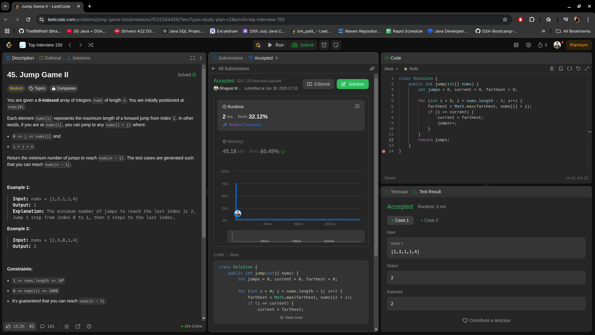

# **🔥 Jump to the Last Index with Minimal Jumps in \(O(n)\) — Optimal Solution 🚀**

## **Problem Statement**
You are given an array `nums` where `nums[i]` represents the maximum jump length from the \(i\)-th index.

**Goal:** Determine the minimum number of jumps required to reach the last index, starting from the first index.

---

## **Intuition**
The problem can be solved using a **greedy approach** by tracking the farthest position (`farthest`) we can reach as we iterate through the array:
- As we move from the start, we calculate how far we can reach from each index.
- At each index, we update the farthest position reachable.
- If we reach the end of the current "jump range", we increment the jump count and extend our reach.
- Continue this process until we can reach or surpass the last index.

The key idea is to minimize the number of jumps by always extending the farthest reach possible at each step.

---

## **Approach**
1. **Initialize Variables:**
   - `jumps = 0` to count the number of jumps.
   - `current = 0` to track the farthest point we can reach with the current jump.
   - `farthest = 0` to track the farthest point that can be reached at each step.
2. **Iterate Through the Array:**
   - For each index \(i\), calculate the farthest point that can be reached (`farthest = max(farthest, i + nums[i])`).
   - If \(i\) equals `current`, it means we've reached the end of the current jump range, so we:
     - Increment `jumps`.
     - Update `current = farthest` to extend our reach.
     - If `current` reaches or exceeds the last index, return the jump count.
3. **Return the Result:**
   - The loop will return the number of jumps required to reach the last index.

---

## **Complexity**
- **Time Complexity:**  
  \(O(n)\), where \(n\) is the length of the array. We only traverse the array once.
  
- **Space Complexity:**  
  \(O(1)\), as we only use a constant amount of extra space for variables.

---

## **Code**
```java
class Solution {
    public int jump(int[] nums) {
        int jumps = 0, current = 0, farthest = 0;

        for (int i = 0; i < nums.length - 1; i++) {
            // Update the farthest point that can be reached
            farthest = Math.max(farthest, nums[i] + i);
            
            // If we've reached the end of the current jump range
            if (i == current) {
                // Make a jump
                jumps++;
                current = farthest;

                // If the farthest point reaches or exceeds the last index, we can stop
                if (current >= nums.length - 1) {
                    break;
                }
            }
        }

        return jumps;
    }
}
```

---


## **Submission**


---

## **Key Example**
Input: `nums = [2, 3, 1, 1, 4]`

1. **Index 0:** \( \text{farthest} = \max(0, 0 + 2) = 2 \)
2. **Index 1:** \( \text{farthest} = \max(2, 1 + 3) = 4 \)
3. **Index 2:** \( \text{farthest} = \max(4, 2 + 1) = 4 \)
4. **Index 3:** \( \text{farthest} = \max(4, 3 + 1) = 4 \)
5. **Index 4:** \( \text{farthest} = \max(4, 4 + 4) = 8 \)

Output: `3` (It takes 3 jumps to reach the last index)

---

## **Edge Cases**
1. **Empty Array:**  
   Input: `nums = []`  
   Output: `0` (No jumps needed, already at the destination)
2. **Single Element Array:**  
   Input: `nums = [0]`  
   Output: `0` (Already at the last index)
3. **Unreachable Index:**  
   Input: `nums = [3, 2, 1, 0, 4]`  
   Output: `4` (Cannot move beyond index 3, hence 4 is unreachable)

---

## **Conclusion**
This greedy approach efficiently calculates the minimum number of jumps required to reach the last index in \(O(n)\) time and \(O(1)\) space. By always focusing on the farthest point we can reach, we avoid unnecessary computations and ensure that we minimize the number of jumps. 🚀
