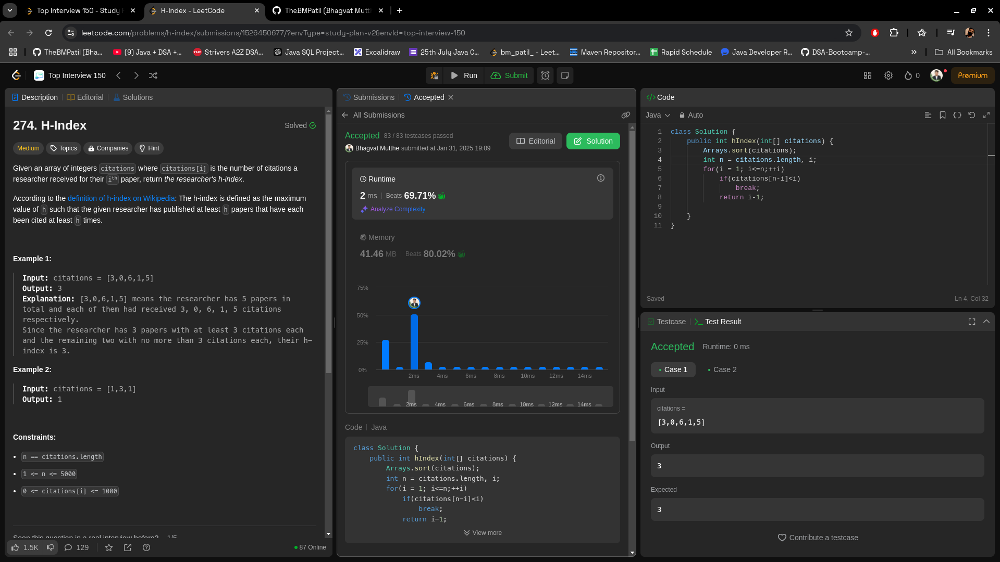

### **🔥 Jump to the Last Index with Minimal Jumps in \(O(n)\) — Optimal Solution 🚀**

---

## **Problem Statement**
You are given an array `nums` where `nums[i]` represents the maximum jump length from the \(i\)-th index.

**Goal:** Determine the minimum number of jumps required to reach the last index, starting from the first index.

---

## **Intuition**
The key to solving this problem lies in identifying the farthest point we can reach at each step and making jumps strategically. By leveraging a **greedy approach**, we:
- Always attempt to maximize our reach at every jump.
- Count jumps only when we exhaust the current reachable range.
- Terminate early once we can reach or surpass the last index.

This ensures an optimal solution with minimal jumps.

---

## **Approach**
1. **Initialize Variables:**
    - `jumps` — Counter to track the number of jumps required.
    - `current` — Tracks the farthest point we can reach with the current jump.
    - `farthest` — Tracks the maximum reach at any point in the iteration.

2. **Iterate Through the Array:**
    - For each index \(i\), calculate the maximum reach from that index:  
      `farthest = max(farthest, i + nums[i])`.
    - If \(i\) equals `current` (i.e., we've used up the current jump range):
        - Increment the jump counter: `jumps++`.
        - Update `current = farthest` to extend our reach.
    - If `current` reaches or surpasses the last index, we can stop early.

3. **Return the Result:**
    - The loop ends when we determine the minimum jumps required.

---

## **Complexity**
- **Time Complexity:**  
  \(O(n)\), as we only traverse the array once.

- **Space Complexity:**  
  \(O(1)\), since only a constant amount of extra memory is used.

---

## **Code**
```java
class Solution {
    public int jump(int[] nums) {
        int jumps = 0, current = 0, farthest = 0;

        for (int i = 0; i < nums.length - 1; i++) {
            // Update the farthest point reachable
            farthest = Math.max(farthest, i + nums[i]);
            
            // If we've reached the end of the current jump range
            if (i == current) {
                jumps++;
                current = farthest;
                
                // Stop if we can already reach the last index
                if (current >= nums.length - 1) {
                    break;
                }
            }
        }

        return jumps;
    }
}
```

---


## **Submission**


---
## **Key Example**

Input: `nums = [2, 3, 1, 1, 4]`

1. Start with `jumps = 0`, `current = 0`, and `farthest = 0`.
2. **Index 0:**
    - \( \text{farthest} = \max(0, 0 + 2) = 2 \)
    - \( \text{current} = 0 \), increment `jumps` to 1, update `current = farthest = 2`.
3. **Index 1:**
    - \( \text{farthest} = \max(2, 1 + 3) = 4 \)
4. **Index 2:**
    - \( \text{farthest} = \max(4, 2 + 1) = 4 \)
    - \( \text{current} = 2 \), increment `jumps` to 2, update `current = farthest = 4`.
5. We reach the last index.

Output: `2` (It takes 2 jumps to reach the last index).

---

## **Edge Cases**
1. **Empty Array:**  
   Input: `nums = []`  
   Output: `0` (No jumps needed).

2. **Single Element Array:**  
   Input: `nums = [0]`  
   Output: `0` (Already at the last index).

3. **Unreachable Index:**  
   Input: `nums = [3, 2, 1, 0, 4]`  
   Output: Return an error or impossible condition since the last index cannot be reached.

---

## **Conclusion**
By adopting this **greedy approach**, we minimize unnecessary computations and ensure the optimal solution. The key is dynamically tracking the farthest reachable index and making jumps only when needed, yielding an \(O(n)\) time complexity with \(O(1)\) space. 🚀
---
